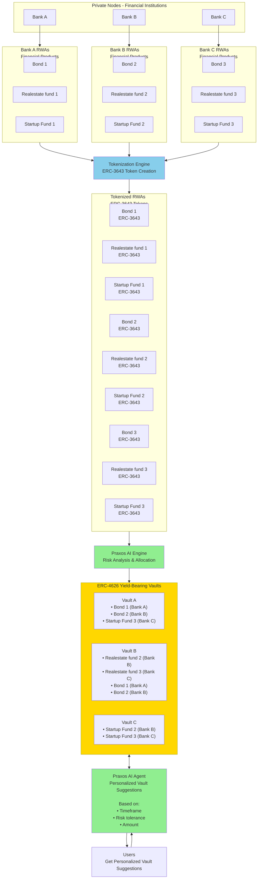

# Praxos System Architecture Flowchart

## Overview

This flowchart illustrates the complete Praxos system for tokenizing Real-World Assets (RWAs), managing them in yield-bearing vaults, and providing personalized vault suggestions to users via an AI agent.

## System Flow

## Component Details

### 1. Private Nodes (Financial Institutions)
- **Bank A, Bank B, Bank C**: Each bank operates a private Rayls node
- Each institution issues various financial products as Real-World Assets (RWAs)

### 2. Financial Products - RWAs
Each bank offers three types of financial products:
- **Bonds**: Fixed-income securities
- **Real Estate Funds**: Property investment products
- **Startup Funds**: Venture capital investment products

### 3. Tokenization Engine
- Converts financial products into **ERC-3643 compliant tokens**
- Example: "Financial product Bond 1" → "ERC-3643 Token Bond 1"
- Enables blockchain-based representation of real-world assets

### 4. Tokenized RWAs
All financial products are tokenized as **ERC-3643 tokens**:
- From Bank A: Realestate fund 1, Bond 1, Startup Fund 1
- From Bank B: Realestate fund 2, Bond 2, Startup Fund 2
- From Bank C: Realestate fund 3, Bond 3, Startup Fund 3

### 5. Praxos AI Engine
- Processes tokenized RWAs
- Performs risk analysis and allocation optimization
- Determines optimal vault compositions

### 6. ERC-4626 Yield-Bearing Vaults
Three diversified vaults containing various ERC-3643 tokens:

**Vault A:**
- Bond 1 (Bank A)
- Bond 2 (Bank B)
- Startup Fund 3 (Bank C)

**Vault B:**
- Realestate fund 2 (Bank B)
- Realestate fund 3 (Bank C)
- Bond 1 (Bank A)
- Bond 2 (Bank B)

**Vault C:**
- Startup Fund 2 (Bank B)
- Startup Fund 3 (Bank C)

### 7. Praxos AI Agent
Provides personalized vault suggestions based on:
- **Timeframe**: Investment duration preferences
- **Risk tolerance**: User's risk appetite
- **Amount**: Investment size

### 8. Users
Users receive personalized vault recommendations from the Praxos AI Agent, enabling informed investment decisions.

## Data Flow Summary

1. **Financial institutions** issue RWAs (bonds, real estate funds, startup funds)
2. **Tokenization Engine** converts RWAs to ERC-3643 tokens
3. **Praxos AI Engine** analyzes and allocates tokens
4. **ERC-4626 vaults** hold diversified token portfolios
5. **Praxos AI Agent** suggests appropriate vaults to users
6. **Users** receive personalized recommendations based on their preferences

