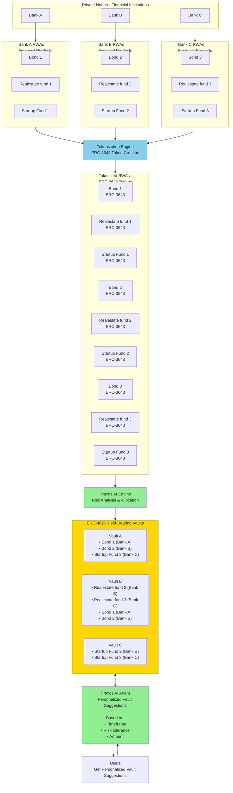

# Praxos

**AI-Generated ERC-4626 Vaults Built From ERC-3643 Real-World Assets**

## Overview

Praxos is a complete system for tokenizing Real-World Assets (RWAs), managing them in yield-bearing vaults, and providing personalized vault suggestions to users via an AI agent.

The system supports both **standard ERC-4626 vaults** and **compliant RWA Index Vaults** that bridge ERC-4626 and ERC-3643 standards, enabling compliant investment products with full identity management, price oracles, and dividend distribution.

The system flow: Financial institutions (Bank A, B, C, etc.) issue financial products (bonds, real-estate funds, startup funds) on private Rayls nodes. These products are tokenized into ERC-3643 compliant tokens via a Tokenization Engine. The Praxos AI Engine then analyzes these tokenized RWAs, performs risk analysis and allocation optimization, and creates diversified ERC-4626 yield-bearing vaults. Finally, the Praxos AI Agent provides personalized vault suggestions to users based on their timeframe, risk tolerance, and investment amount.

These vaults act like "honey cells" in a honeycomb — modular financial building blocks that users can choose from depending on risk, duration, and diversification.

## Motivation

### Banks / Institutions

Banks running Rayls private nodes want:

- more liquidity across their financial products
- increased demand for their tokenized RWAs
- better distribution channels
- composable products for broader investors

### Rayls

Rayls benefits from:

- more private nodes onboarded
- increased RWA issuance
- deeper institutional adoption
- more activity on the network

### Users

Users want:

- diversified investment vaults
- simple abstraction over complex RWAs
- clear risk categories
- automated portfolio construction

**Praxos satisfies all three.**

## Architecture

For a detailed system flowchart, see [docs/PraxosFlowchart.md](./docs/PraxosFlowchart.md).

### Vault Architecture Options

Praxos supports two vault architectures:

1. **Standard Vaults** (`PraxosVault`): Simple ERC-4626 vaults for non-compliant or permissionless RWAs
2. **Compliant Vaults** (`PraxosVaultCompliant`): Full RWA compliance architecture with:
   - ONCHAINID identity management
   - Price oracle integration
   - Dividend harvesting and distribution
   - Compliant swap mechanisms
   - Rewards module support

For detailed information on the compliant architecture, see:
- [docs/COMPLIANT_VAULT_ARCHITECTURE.md](./docs/COMPLIANT_VAULT_ARCHITECTURE.md) - Complete architecture explanation
- [docs/IMPLEMENTATION_GUIDE.md](./docs/IMPLEMENTATION_GUIDE.md) - Step-by-step deployment guide
- [docs/VAULT_STORAGE_EXPLANATION.md](./docs/VAULT_STORAGE_EXPLANATION.md) - Vault data storage patterns



## System Breakdown

### 1. Private Node Layer (Financial Institutions)

Each participating bank (Bank A, Bank B, Bank C, etc.) runs a private Rayls node, issuing financial products such as:

- corporate bonds
- real-estate investment products
- startup investment funds
- revenue-sharing agreements
- credit risk pools

Each product includes identity gating, transfer restrictions, and compliance enforcement.

### 2. Tokenization Engine

The Tokenization Engine converts financial products into **ERC-3643 compliant tokens**, enabling blockchain-based representation of real-world assets.

- Takes raw financial products from institutions
- Converts them to ERC-3643 standard tokens
- Example: "Financial product Bond 1" → "ERC-3643 Token Bond 1"
- Enables composability and interoperability on-chain

### 3. Tokenized RWAs

All financial products are tokenized as **ERC-3643 tokens**, creating a standardized on-chain representation of real-world assets from multiple institutions.

### 4. Risk Simulation Layer

Praxos models each ERC-3643 tokenized product by simulating:

- yield curves
- credit/default risk
- volatility
- maturity and duration
- redemption/liquidity windows
- counterparty risk

Outputs a standardized risk signature per product.

### 5. Praxos AI Engine

The Praxos AI Engine processes tokenized RWAs and performs:

- **Risk Analysis**: Evaluates risk profiles for all tokenized assets
- **Allocation Optimization**: Constructs optimal vault strategies by considering:
  - risk tiers
  - duration buckets
  - diversification needs
  - regulatory constraints
  - modeled performance scenarios

Produces a set of vault candidates with optimal asset allocations.

### 6. ERC-4626 Yield-Bearing Vaults

Each AI-created strategy is compiled into a deployable ERC-4626 Vault, ready for deposits.

These vaults are:

- compliant with ERC-4626 standard
- structured and diversified
- composed of multiple ERC-3643 RWAs
- dynamically generated by the AI
- optimized for risk-adjusted returns

Example vaults:
- **Vault A**: Bond 1 (Bank A), Bond 2 (Bank B), Startup Fund 3 (Bank C)
- **Vault B**: Realestate fund 2 (Bank B), Realestate fund 3 (Bank C), Bond 1 (Bank A), Bond 2 (Bank B)
- **Vault C**: Startup Fund 2 (Bank B), Startup Fund 3 (Bank C)

### 7. Praxos AI Agent

The Praxos AI Agent provides **personalized vault suggestions** to users based on:

- **Timeframe**: Investment duration preferences (short-term, medium-term, long-term)
- **Risk tolerance**: User's risk appetite (conservative to aggressive)
- **Amount**: Investment size and constraints

The AI Agent analyzes available vaults and matches them to user preferences, enabling informed investment decisions.

### 8. User Interface

Users interact with Praxos through the web interface, where they can:

- View available vaults created by the AI
- Receive personalized recommendations from the Praxos AI Agent
- Deposit into vaults
- Monitor their investments
- Withdraw when needed

Each vault is represented as an ERC-4626 contract containing a diversified portfolio of ERC-3643 assets.

## Getting Started

### Quick Start

See [docs/QUICKSTART.md](./docs/QUICKSTART.md) for a 5-minute setup guide.

### Installation

1. **Install Node.js and npm:**
   ```bash
   # Install Node.js 18+ from https://nodejs.org/
   node --version  # Should be 18.0.0 or higher
   ```

2. **Install Dependencies:**
   ```bash
   # Install Hardhat and dependencies
   make install
   # Or manually: npm install
   
   # Set up Python environment for offchain components
   cd offchain && python3 -m venv venv && source venv/bin/activate
   pip install -r requirements.txt
   cd ..
   ```

3. **Set up environment variables:**
   ```bash
   # Copy the example file
   cp .env.example .env
   
   # Edit .env and add your private key (without 0x prefix)
   # Get your private key from MetaMask: Account Details > Export Private Key
   # WARNING: Never commit .env to git!
   ```

4. **Get testnet tokens:**
   - See [docs/FAUCET.md](./docs/FAUCET.md) for detailed instructions
   - Add Rayls Devnet to MetaMask (Chain ID: 123123)
   - Request USDr tokens from the Rayls faucet
   - You'll need ~20-50 USDr for deployment and testing

5. **Deploy to Rayls Devnet:**
   ```bash
   # Deploy contracts
   make deploy
   # Or manually: npx hardhat run scripts/deploy.mjs --network rayls_devnet
   ```

See [docs/SETUP.md](./docs/SETUP.md) for detailed setup instructions.

## Project Structure

```
praxos/
├── contracts/
│   ├── interfaces/
│   │   ├── IERC3643.sol                    # ERC-3643 RWA token interface
│   │   ├── ICompliantStrategyAdapter.sol   # Interface for compliance adapter
│   │   ├── IPriceOracle.sol                # Interface for RWA price oracle
│   │   ├── IDividendDistributor.sol        # Interface for dividend distribution
│   │   └── IIdentity.sol                   # Interface for ONCHAINID identity
│   ├── mocks/
│   │   ├── MockERC20.sol                   # Mock ERC20 token for testing
│   │   ├── MockERC3643.sol                 # Mock ERC-3643 RWA tokens for testing
│   │   ├── MockUSDC.sol                    # Mock USDC for deployment
│   │   ├── CompliantStrategyAdapter.sol    # Mock compliance adapter implementation
│   │   ├── SimplePriceOracle.sol           # Mock price oracle implementation
│   │   └── SimpleDividendDistributor.sol  # Mock dividend distributor implementation
│   ├── PraxosVault.sol                     # ERC-4626 vault implementation (standard)
│   ├── PraxosVaultCompliant.sol            # ERC-4626 compliant vault with RWA support
│   ├── PraxosVaultExtended.sol             # Extended vault with APR and metadata
│   ├── PraxosFactory.sol                   # Vault factory contract (standard)
│   ├── PraxosFactoryCompliant.sol          # Compliant vault factory with infrastructure
│   └── RewardsModule.sol                   # Rewards distribution module for dividends
├── scripts/
│   ├── deploy.mjs                # Hardhat deployment script
│   ├── abi/
│   │   ├── cleanAbi.mjs          # Clean ABI directory utility
│   │   └── saveAbi.mjs           # Save contract ABIs utility
│   ├── logs/
│   │   ├── console_logger.mjs    # Console logging utilities
│   │   └── data/
│   │       └── data_logger.mjs   # Deployment history logging
│   └── roles/
│       └── assignRoles.mjs       # Role assignment utilities
├── test/
│   └── Praxos.test.js            # Hardhat/Mocha tests
├── offchain/
│   ├── simulation/
│   │   └── risk_model.py         # Risk simulation layer
│   ├── ai_engine/
│   │   └── allocation_engine.py  # Praxos AI Engine (risk analysis & allocation)
│   ├── ai_agent/
│   │   └── suggestion_engine.py # Praxos AI Agent (personalized suggestions)
│   ├── vault_generator.py        # Main orchestrator
│   └── requirements.txt           # Python dependencies
├── praxos-app/                   # Next.js frontend application
│   ├── app/                      # Next.js app directory
│   ├── components/               # React components
│   │   ├── dashboard/            # Dashboard components
│   │   └── ui/                   # UI component library
│   ├── lib/                      # Utilities and hooks
│   │   ├── contracts.ts          # Contract data loading utilities
│   │   ├── hooks/                 # Wagmi hooks for contract interactions
│   │   └── data/                  # Contract deployment data (auto-generated)
│   └── package.json              # Frontend dependencies
├── frontend/                     # Legacy frontend (deprecated)
│   ├── index.html                # Web interface
│   └── app.js                    # Frontend logic
├── docs/
│   ├── HACKATHON_RULES.md              # Rayls hackathon rules
│   ├── PraxosFlowchart.md              # System architecture flowchart
│   ├── QUICKSTART.md                   # Quick start guide
│   ├── SETUP.md                        # Detailed setup guide
│   ├── COMPLIANT_VAULT_ARCHITECTURE.md # Compliant RWA vault architecture
│   ├── IMPLEMENTATION_GUIDE.md         # Step-by-step implementation guide
│   └── VAULT_STORAGE_EXPLANATION.md    # Vault data storage patterns
├── abi/                          # Generated contract ABIs (auto-generated)
├── deployments/                  # Deployment history logs (auto-generated)
├── hardhat.config.js             # Hardhat configuration
├── package.json                  # Node.js dependencies
├── Makefile                      # Build automation
├── .env.example                  # Environment variables template
└── README.md                     # This file
```

## Key Components

### Smart Contracts

#### Core Vault Contracts

- **`PraxosVault.sol`**: Standard ERC-4626 compliant vault that holds multiple ERC-3643 RWA tokens
  - Multi-asset allocation support
  - Weight-based portfolio management
  - Strategy and risk tier tracking
  - Owner-controlled asset management

- **`PraxosVaultCompliant.sol`**: Enhanced compliant vault with full RWA architecture
  - ONCHAINID identity support for compliance
  - Price oracle integration for NAV calculation
  - Dividend harvesting (push and pull scenarios)
  - Auto-compound or rewards module support
  - Compliant swap integration via strategy adapter
  - See [docs/COMPLIANT_VAULT_ARCHITECTURE.md](./docs/COMPLIANT_VAULT_ARCHITECTURE.md) for details

- **`PraxosVaultExtended.sol`**: Extended vault with additional metadata storage
  - APR storage in basis points
  - Description and metadata URI support
  - Example of how to extend base vault functionality

#### Factory Contracts

- **`PraxosFactory.sol`**: Standard factory for deploying `PraxosVault` instances
  - Creates vaults from AI-generated strategies
  - Validates vault configurations
  - Tracks all deployed vaults

- **`PraxosFactoryCompliant.sol`**: Factory for deploying compliant vaults
  - Deploys `PraxosVaultCompliant` with compliance infrastructure
  - Integrates strategy adapter and price oracle
  - Supports dividend distributor configuration
  - Handles vault whitelisting during creation

#### Supporting Contracts

- **`RewardsModule.sol`**: Optional module for distributing raw dividends to vault shareholders
  - Similar to Synthetix StakingRewards pattern
  - Users claim rewards based on vault share balance
  - Used when auto-compounding is disabled

#### Interfaces

- **`IERC3643.sol`**: Interface for ERC-3643 compliant RWA tokens
- **`ICompliantStrategyAdapter.sol`**: Interface for compliance and whitelisting adapter
- **`IPriceOracle.sol`**: Interface for RWA token price feeds
- **`IDividendDistributor.sol`**: Interface for dividend claiming and distribution
- **`IIdentity.sol`**: Interface for ONCHAINID identity verification

#### Mock Contracts (Testing & Development)

- **`MockERC3643.sol`**: Mock implementation of ERC-3643 for testing and demos
- **`MockERC20.sol`**: Mock ERC20 token for testing
- **`MockUSDC.sol`**: Mock USDC token for deployment scripts
- **`CompliantStrategyAdapter.sol`**: Mock compliance adapter with whitelisting
- **`SimplePriceOracle.sol`**: Mock price oracle with configurable prices
- **`SimpleDividendDistributor.sol`**: Mock dividend distributor for testing

### Off-Chain Components

- **Tokenization Engine**: Converts financial products into ERC-3643 compliant tokens (handled by institutions on private nodes)
- **Risk Simulation Layer**: Models risk profiles for RWA tokens (credit score, volatility, liquidity, etc.)
- **Praxos AI Engine**: Performs risk analysis and constructs optimal vault strategies based on risk signatures
- **Vault Generator**: Orchestrates the full pipeline from tokenized RWAs to deployable vault configs
- **Praxos AI Agent**: Provides personalized vault suggestions to users based on timeframe, risk tolerance, and investment amount

### Frontend (praxos-app)

The frontend is a modern Next.js application with full smart contract integration:

- **Dashboard**: View all available vaults with real-time blockchain data
- **Wallet Integration**: RainbowKit + Wagmi for multi-wallet support
- **Deposit/Withdraw**: Full ERC-4626 deposit and withdrawal functionality
- **USDC Approval Flow**: Automatic two-step approval and deposit process
- **Real-time Data**: Fetches vault information directly from blockchain
- **Mock Data Fallback**: Falls back to mock data if contracts aren't deployed
- **Contract Loading**: Automatically loads contract addresses from deployment data

Key features:
- Loads vaults from `PraxosFactory` or `PraxosFactoryCompliant`
- Displays vault strategy, risk tier, APR, and asset allocations
- Interactive deposit dialogs with amount input
- Transaction status tracking (pending, success, error)
- Responsive design with dark theme

## Development

### Build

```bash
make build
# Or: npx hardhat compile
```

### Test

```bash
make test
# Or: npx hardhat test
```

### Deploy Contracts

```bash
# Deploy to Rayls Devnet
make deploy
# Or: npx hardhat run scripts/deploy.mjs --network rayls_devnet

# This will deploy:
# 1. Infrastructure Contracts:
#    - CompliantStrategyAdapter (compliance and whitelisting)
#    - SimplePriceOracle (RWA token price feeds)
#    - SimpleDividendDistributor (dividend distribution)
# 2. Factory Contracts:
#    - PraxosFactory (standard vault factory)
#    - PraxosFactoryCompliant (compliant vault factory)
# 3. Base Assets:
#    - MockUSDC (base asset for vaults)
# 4. RWA Tokens:
#    - Corporate Bond Alpha (MockERC3643)
#    - Real Estate Fund Beta (MockERC3643)
#    - Startup Fund Gamma (MockERC3643)
# 5. Demo Vaults:
#    - Balanced Diversified Vault (standard)
#    - Compliant Balanced Diversified Vault (compliant)
# 6. Optional:
#    - RewardsModule (for dividend distribution)

# After deployment:
# - Contract addresses saved to .env
# - Deployment data saved to deployments/
# - Contract data saved to frontend/lib/data/contracts_data.json
# - Contract data saved to praxos-app/lib/data/contracts_data.json
```

### Generate Vault Strategies

```bash
cd offchain
python vault_generator.py
```

### Frontend Development

```bash
cd praxos-app
npm install  # or pnpm install
npm run dev  # Start development server on http://localhost:3000
```

The frontend automatically loads contract addresses from `praxos-app/lib/data/contracts_data.json`, which is populated by the deploy script.

## Rayls Integration

Praxos is built for the **Rayls ecosystem**:

- **Chain**: Rayls Public Chain (EVM compatible)
- **Devnet**: `https://devnet-rpc.rayls.com` (Chain ID: 123123)
- **Gas Token**: USDgas (USDr)
- **Explorer**: `https://devnet-explorer.rayls.com`

See [docs/HACKATHON_RULES.md](./docs/HACKATHON_RULES.md) for hackathon requirements.

## License

MIT
